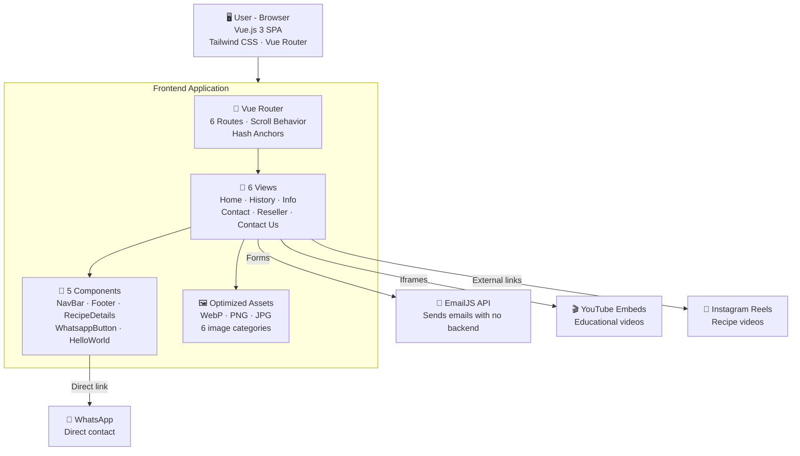

<p align="center">
  <h1 align="center">🦂 Soda Cáustica Escorpião — Institutional Website</h1>
  <p align="center">
    A modern, responsive institutional website built from scratch for a chemical industry with over 50 years of tradition.
    <br/>
    <strong>Vue.js 3 · Vite 6 · Tailwind CSS 3 · EmailJS · Lucide Icons</strong>
  </p>
</p>

<p align="center">
  
  
  
  
  
  
</p>

---

## 📋 About the Project

An institutional website built for **Soda Cáustica Escorpião**, a chemical industry founded in **1970** in the city of Vitória – ES, a national reference in the caustic soda segment. The project showcases the company, its products, homemade soap recipes, points of sale, and contact channels, all with a modern interface, fluid animations, and a responsive experience.

This is a 100% frontend **Single Page Application (SPA)**, requiring no backend, database, or dedicated server — ideal for static deployment on any platform.

**🌐 Live project:** [sodaescorpiao.com.br](https://sodaescorpiao.com.br)

### 📸 Preview

<table>
  <tr>
    <td align="center"><br/><sub>Home / Landing Page</sub></td>
    <td align="center"><br/><sub>Products Section</sub></td>
    <td align="center"><br/><sub>Recipes Section</sub></td>
  </tr>
  <tr>
    <td align="center"><br/><sub>Information & Handling</sub></td>
    <td align="center"><br/><sub>Contact Hub</sub></td>
    <td align="center"><br/><sub>Contact Form</sub></td>
  </tr>
</table>

---

## ✨ Features

### 🏠 Home / Landing Page
- **Full-screen hero cover image** (optimized in WebP)
- **Company section** with a responsive image grid gallery and institutional text
- **Mission, Vision and Values** with glassmorphism cards, floating icons and gradients
- **Products section** with a visual catalog (Soda 500g, 1kg and Liquid) with hover effects and dynamic drop-shadow
- **Interactive Recipes section** with a tab system (desktop) and accordion (mobile) for homemade soap recipes
- **Instagram videos** with clickable thumbnails and direct reels integration
- **Where to Buy section** with a grid of distributor categories
- **"About Us"** and **"Handling Information"** call-to-action buttons

### 📖 Our History (`/nossa-historia`)
- Dedicated page about the company's history since the 1970s
- Editorial layout with careful typography and entrance animations

### ℹ️ Information (`/info`)
- **Safety Data Sheet (SDS)** with PDF download
- **Handling guide** with informational cards (PPE, storage, clothing, fire fighting)
- **Emergency center** with contact phone number
- **Educational videos** from YouTube (PPE and unclogging)

### 📞 Contact (`/contato`)
- Central hub with two paths: **Become a Reseller** and **Contact Us**
- Interactive cards with hover effects and router-link navigation

### 🤝 Become a Reseller (`/contato/revendedor`)
- Complete form with: Name, Email, Phone, Company, CNPJ (Tax ID) and Message
- **Sent via EmailJS** (no backend needed!)
- Visual feedback: loading spinner, success/error message
- Required field validation with informative tooltip

### 💬 Contact Us (`/contato/fale-conosco`)
- General contact form with: Name, Email, Phone, Company (optional) and Message
- **Sent via EmailJS** with full visual feedback
- Same UX pattern as the reseller form

### 🎨 Design & UX
- **Scroll animations** with Intersection Observer (reveal, scale, slide)
- **Fixed navbar** with backdrop blur, section scroll spy and animated indicator
- **Mobile menu** floating card with slide-fade animation
- **Floating WhatsApp button** for direct contact
- **Footer** with contact information, social media and credits
- **Consistent color palette**: red tones (#720e0e), beige (#faf4ef) and white
- **Typography**: Google Fonts Montserrat (500–800)
- **Fully responsive**: desktop, tablet and mobile

---

## 🛠️ Tech Stack

| Technology | Usage |
|---|---|
| **Vue.js 3** | SPA framework with Composition API (`<script setup>`) |
| **Vite 6** | Ultra-fast build tool and dev server with HMR |
| **Tailwind CSS 3.4** | Responsive utility-first styling |
| **Vue Router 4** | SPA routing with custom scroll behavior (hash anchors) |
| **EmailJS** | Sends emails directly from the frontend (no backend) |
| **Lucide Vue Next** | SVG icon library (40+ icons used) |
| **Sharp** | Image optimization at build time (WebP conversion) |
| **Google Fonts** | Typography: Montserrat (500, 600, 700, 800) |

---

## 🏗️ Architecture



---

## 📂 Project Structure

```
project_escorpiao/
│
└── frontend/
    ├── index.html                    # HTML entry point with meta tags and Google Fonts
    ├── vite.config.js                # Vite configuration (Vue plugin)
    ├── tailwind.config.cjs           # Tailwind configuration (Montserrat font)
    ├── postcss.config.js             # PostCSS with Tailwind and Autoprefixer
    ├── package.json                  # Dependencies and scripts
    ├── optimize-images.js            # Image optimization script (Sharp → WebP)
    │
    ├── public/
    │   ├── IconeEscorpiaoQuadrado.png   # Favicon
    │   └── static/uploads/              # PDFs (Safety Data Sheets)
    │
    └── src/
        ├── App.vue                   # Root component (NavBar + Router View + Footer + WhatsApp)
        ├── main.js                   # Vue app + Router bootstrap
        ├── style.css                 # Global style reset
        │
        ├── router/
        │   └── index.js              # 6 routes with custom scroll behavior
        │
        ├── views/
        │   ├── HomeView.vue          # Full landing page (Company, Products, Recipes, Where to Buy)
        │   ├── HomeHistory.vue       # "Our History" page
        │   ├── InfoView.vue          # Safety information + handling + videos
        │   ├── ContactView.vue       # Contact hub (Reseller / Contact Us)
        │   ├── ContactDealer.vue     # "Become a Reseller" form (EmailJS)
        │   └── ContactUs.vue         # "Contact Us" form (EmailJS)
        │
        ├── components/
        │   ├── NavBar.vue            # Fixed navbar with scroll spy, mobile menu and social media
        │   ├── Footer.vue            # Footer with contact info, social media and credits
        │   ├── RecipeDetails.vue     # Recipes component (4 types: bar, Pará, videos, liquid)
        │   ├── WhatsappButton.vue    # Floating WhatsApp button
        │   └── HelloWorld.vue        # Default Vite component (unused)
        │
        └── assets/
            ├── LogoEscorpiao.png     # Main logo
            ├── empresa/              # Company section images (6 photos + mission/vision/values icons)
            ├── identidade/           # Home cover image (optimized WebP)
            ├── produto/              # Product images (500g, 1kg, liquid)
            ├── receitas/             # Recipe video thumbnails
            ├── ondeComprar/          # Point-of-sale icons
            └── local/                # Location images
```

---

## 🖼️ Image Optimization

The project includes a custom image optimization script using **Sharp**:

```
Original Image (JPG/PNG)
  ↓
Sharp (Node.js)
  ├── Smart resize (800px for grid, 1200px for cover)
  ├── Conversion to WebP (quality 80)
  └── Output: file-opt.webp
```

Resulting in a **70–90% reduction in file size** with no perceptible loss of quality.

---

## 🎬 Animations & Micro-interactions

The site uses a robust scroll animation system based on the **Intersection Observer API**:

| Type | Effect | Usage |
|---|---|---|
| `reveal-element` | Fade in + slide up | Text and titles |
| `reveal-scale` | Fade in + scale up | Cards and images |
| `reveal-left` | Fade in + slide left | Recipe buttons |
| `icon-float` | Continuous floating | Mission/Vision/Values icons |
| `slide-fade` | Slide + fade (Vue transition) | Recipe content switching |
| `expand` | Smooth accordion | Recipes on mobile |

Each animation uses **staggered delays** (100ms–600ms) to create smooth cascade effects.

---

## 🚀 How to Run the Project

### Prerequisites

- **Node.js** version 18 or higher → [Download](https://nodejs.org/)
- **npm** (already comes with Node.js)

### Step by step

```bash
# 1. Clone the repository
git clone https://github.com/Xavis01/project_escorpiao.git

# 2. Enter the frontend folder
cd project_escorpiao/frontend

# 3. Install dependencies
npm install

# 4. Start the development server
npm run dev
```

The site will be available at `http://localhost:5173` 🎉

### Other useful commands

```bash
# Generate production build
npm run build

# Preview the production build
npm run preview

# Optimize images (generates WebP versions)
node optimize-images.js
```

> **💡 Note:** Since this is a 100% frontend site (SPA), there is no need to configure a backend, database, or environment variables. Just install the dependencies and run!

---

## 📱 Responsiveness

The site was built with a **mobile-first** approach, ensuring a perfect display on:

- 📱 **Mobile** (< 768px) — Hamburger menu, accordion for recipes, stacked layout
- 📊 **Tablet** (768px–1024px) — Adapted grid, hybrid navigation
- 🖥️ **Desktop** (> 1024px) — Full layout with scroll spy, recipes in a side panel

---

## 🔗 Integrations

| Service | Usage |
|---|---|
| **EmailJS** | Sends contact and reseller forms (directly from the frontend, no backend) |
| **YouTube** | Embedded educational videos (PPE, recipes) |
| **Instagram** | Links to soap recipe reels |
| **WhatsApp** | Floating direct contact button |
| **Google Fonts** | Montserrat typography |

---

## 👨‍💻 Author

**Lucas Xavier**

---

<p align="center">
  <sub>Built with dedication — from design to deployment. 🚀</sub>
</p>
